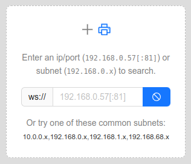
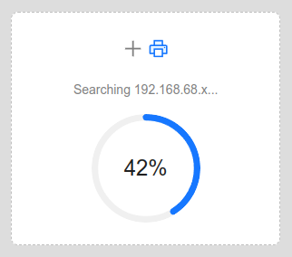
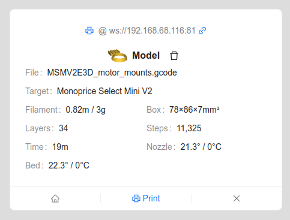

# G-Code to Websocket

This webapp lets you stream G-Code (created by [Cura](https://ultimaker.com/software/ultimaker-cura/), [Orca Slicer](https://github.com/SoftFever/OrcaSlicer), etc.) to your websocket-enabled printer(s).

**[TRY IT HERE!](http://gcode2ws.kered.org/)**

Known compatible printers:
- [Monoprice Select Mini 3D Printer V2](https://www.monoprice.com/product?p_id=34620)
- [Malyan M200 3D Printer](https://malyansys.com/product/m200-v1/)

## FAQ

### These printers have a built-in webapp, so why use this?

The built-in webapps (even with "high speed" enabled) can only upload your file at ~10-20kB/s.  The upload often fails, and when it doesn't it usually takes half as long as the estimated print time! 🤦

Because this project streams the G-Code, prints start instantly.  (You don't even need an SD card.)

### Why not stream G-Code to port 23 using a tool like [gcode-cli](https://github.com/hzeller/gcode-cli)?

The printer's handling of telnet sessions is unreliable (even with good WiFi).  I've never seen it not fail, even with short prints.

### Isn't the WiFi on on these printers terrible?

Yes it is!  Fortunately (from my experience_ if it's close enough to your router or a repeater (like in the same room), it's good enough.

### Is my model or G-Code uploaded to the cloud?

No, neither ever leaves your network.  The whole app is static HTML + Javascript, hosted by Github, and collects no data.

## Screenshots

   

## Limitations

Because it's streaming G-Code from your browser, you have to keep your computer on and the site open for the duration of the print.

## Links
- [mpselectmini.com](https://www.mpselectmini.com/)
